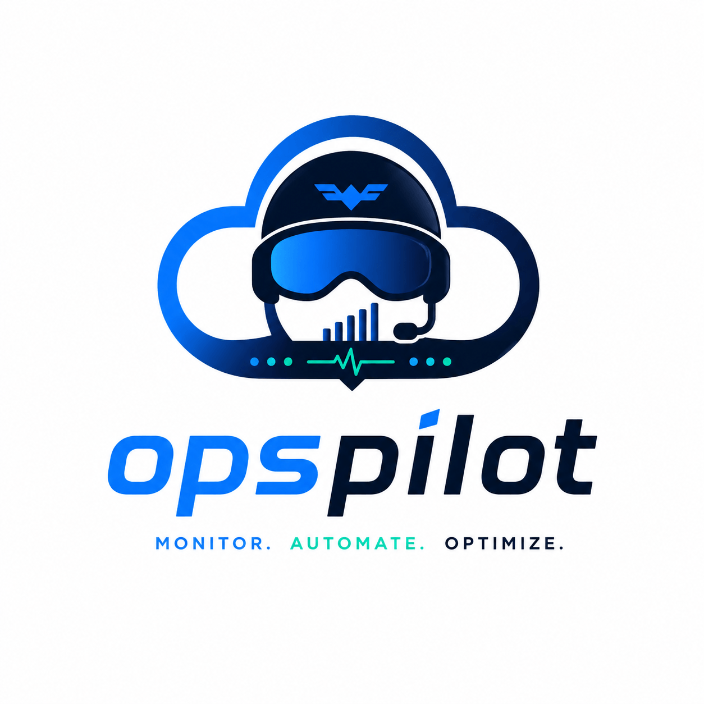

# 🚀 OpsPilot



**Modern DevOps Automation for Linux.**
A fast, modular, and extensible command-line toolkit for system administration, infrastructure automation, monitoring, and operational workflows.


---

## 📖 Overview

**OpsPilot** is an open-source DevOps automation toolkit built for Linux Professionals, System Administrators, DevOps Engineers, Platform Engineers, Cloud Engineers, and anyone who enjoys working from the terminal.

The project aims to simplify repetitive operational tasks through a clean, intuitive, and extensible command-line interface.

Rather than being a collection of unrelated scripts, OpsPilot is designed as a unified platform that grows alongside modern DevOps practices — from basic system inspection to infrastructure automation, container orchestration, monitoring, cloud operations, and DevSecOps.

This repository documents the journey from a lightweight Linux utility into a production-grade DevOps toolkit.

---

## ✨ Vision

Build one command-line application capable of helping Engineers manage, monitor, automate, troubleshoot, and secure Linux systems from a single interface.

OpsPilot embraces three principles:

* **Automation over repetition**
* **Simplicity over complexity**
* **Reliability over cleverness**

---

## 🎯 Project Goals

OpsPilot is designed to:

* Simplify Linux administration
* Reduce repetitive operational work
* Encourage Infrastructure as Code (IaC) practices
* Provide a beautiful and intuitive CLI experience
* Encourage automation-first workflows
* Serve as an educational platform for learning DevOps
* Grow into a production-ready open-source project

---

## 🛠 Planned Features

### System Information

* CPU information
* Memory usage
* Disk usage
* Filesystem details
* Network interfaces
* Host information
* Uptime
* Operating system details

---

### Monitoring

* System health reports
* Resource monitoring
* Process monitoring
* Service monitoring
* Network monitoring
* Performance summaries

---

### Log Analysis

* SSH authentication logs
* System logs
* Apache logs
* Nginx logs
* Docker logs
* Error summaries
* Security event analysis

---

### Backup Management

* Directory backups
* Incremental backups
* Scheduled backups
* Archive compression
* Backup verification
* Restore functionality

---

### Service Management

* View services
* Restart services
* Stop services
* Enable services
* Disable services
* Health checks

---

### Network Utilities

* Open ports
* Active connections
* DNS lookup
* Ping utilities
* Route inspection
* Interface statistics

---

### Automation

* Scheduled tasks
* Cleanup jobs
* System maintenance
* Report generation
* Custom automation scripts

---

### Docker Support *(Future)*

* Containers
* Images
* Networks
* Volumes
* Compose utilities

---

### Kubernetes *(Future)*

* Cluster inspection
* Pod monitoring
* Deployments
* Services
* Namespaces

---

### Cloud *(Future)*

* AWS
* Azure
* Google Cloud

---

### DevSecOps *(Future)*

* Security auditing
* Configuration validation
* Secret detection
* Compliance checks

---

## 🚀 Why OpsPilot?

Many Linux automation tools focus on solving a single problem.

OpsPilot takes a different approach.

It provides one consistent interface for common operational tasks while remaining lightweight, modular, and easy to extend.

Instead of remembering dozens of commands, users interact with a single CLI.

---

## 🧱 Architecture

OpsPilot follows a modular architecture.

Every feature lives in its own command module.

```text
src/
└── opspilot/
    ├── commands/
    ├── utils/
    ├── cli.py
    ├── main.py
    └── __init__.py
```

This makes new functionality easy to add without affecting existing commands.

---

## 📂 Project Structure

```text
opspilot/
│
├── assets/
├── docs/
├── scripts/
├── src/
│   └── opspilot/
├── tests/
│
├── CHANGELOG.md
├── CONTRIBUTING.md
├── LICENSE
├── README.md
├── ROADMAP.md
└── pyproject.toml
```

---

## ⚡ Installation

### Clone the repository

```bash
git clone https://github.com/ikwukao/opspilot.git
```

```bash
cd opspilot
```

---

### Create a virtual environment

```bash
python -m venv .venv
```

Linux/macOS

```bash
source .venv/bin/activate
```

Windows

```powershell
.venv\Scripts\activate
```

---

### Install dependencies

```bash
pip install -e .
```

---

## 🖥 Usage

Examples:

```bash
opspilot info
```

```bash
opspilot cpu
```

```bash
opspilot memory
```

```bash
opspilot disk
```

```bash
opspilot network
```

```bash
opspilot processes
```

---

## Minimum Supported Version of Technologies

| **Technology**     | **Minimum Version**                               |
| ------------------ | ------------------------------------------------- |
| Python             | 3.12                                              |
| Go                 | 1.24 (or the current stable version you're using) |
| Bash               | 5.1+                                              |
| Docker             | Current stable                                    |
| Kubernetes         | Current stable                                    |
| Terraform/OpenTofu | Current stable                                    |

---

## 🗺 Roadmap

### Version 0.1

* Project initialization
* CLI framework
* System information
* CPU inspection
* Memory inspection
* Disk inspection
* Network inspection

---

### Version 0.2

* Health reports
* Log analysis
* Report generation

---

### Version 0.3

* Backup manager
* Restore manager
* Compression

---

### Version 0.4

* Service management
* Cron management
* Cleanup automation

---

### Version 0.5

* Docker support

---

### Version 0.6

* Kubernetes support

---

### Version 0.7

* Cloud integrations

---

### Version 1.0

Production-ready DevOps platform.

---

## 🧪 Testing

Tests are written using **pytest**.

Run all tests:

```bash
pytest
```

---

## 🤝 Contributing

Contributions are welcome.

Whether you're fixing bugs, improving documentation, adding features, or suggesting ideas, your help is appreciated.

Please read **CONTRIBUTING.md** before submitting a pull request.

---

## 📚 Documentation

Additional documentation can be found inside the `docs/` directory.

* Product Requirements
* Architecture
* Development Log
* Roadmap
* Design Decisions

---

## 🔒 Security

If you discover a security issue, please open a private security report instead of creating a public issue.

Responsible disclosure is appreciated.

---

## 💡 Project Philosophy

OpsPilot follows several guiding principles:

* Build small, iterate often.
* Prefer readability over cleverness.
* Keep dependencies minimal.
* Design for extensibility.
* Automate repetitive work.
* Make operational tasks enjoyable.

---

## 🛣 Long-Term Vision

OpsPilot is intended to evolve into a complete DevOps platform capable of supporting:

* Infrastructure automation
* Cloud operations
* CI/CD workflows
* Container management
* Kubernetes administration
* Monitoring and observability
* DevSecOps automation
* Incident response tooling
* Operational reporting
* Platform engineering workflows

---

## 📄 License

This project is licensed under the MIT License.

See the **LICENSE** file for details.

---

## 👨‍💻 Author

Ikwuka Okoye

DevOps Engineer

GitHub: [https://github.com/ikwukao](https://github.com/ikwukao)

X (Twitter): [https://x.com/ikwukao_](https://x.com/ikwukao_)

---

## ⭐ Support the Project

If you find OpsPilot useful:

* ⭐ Star the repository
* 🐛 Report bugs
* 💡 Suggest features
* 🤝 Contribute code
* 📖 Improve documentation

Every contribution helps make OpsPilot better.

---

Build once. Automate forever.

Made with ❤️ for the Linux and DevOps community.
